# Eatinout — Email System Audit

**Audit type:** Read-only. No application code, templates, database, or configuration were modified.
**Scope:** Every transactional email the platform can send.
**Emails found:** 12 (10 rendered via React Email templates + 2 built as inline HTML strings).
**Sending mechanism:** All email is sent through **Nodemailer** over Office365 SMTP (`smtp.office365.com:587`, STARTTLS). There is no Resend/SendGrid/Supabase mail in use.

---

## CRITICAL FINDINGS (flag to director before go-live)

1. **Hardcoded SMTP credentials committed in source.** The mailbox login and password appear in plaintext in **three** files: `lib/sendEmail.ts`, `app/api/send-contact-email/route.ts`, and `app/api/restaurant/request-email-change/route.ts` (`user: "Info@eatinout.com"`, `pass: "ChopsY123!"`). This password is exposed to anyone with repository access and should be rotated and moved to environment variables immediately.
2. **Sender identity is inconsistent.** Most mail sends as `"Eatinout" <Info@eatinout.com>`, but the OTP email sends as `"EatinOut Info" <Info@eatinout.com>`.
3. **Placeholder / broken links in customer templates.** The shared email layout footer uses `href="#"` for social and legal links, and the logo image is commented out, so no brand logo renders in any templated email.
4. **Two emails bypass the shared template system** (OTP verification and the contact-form email are hand-built HTML strings), so they do not share branding, footer, or unsubscribe treatment with the rest.
5. **No List-Unsubscribe header and no unsubscribe link** on any email, including customer-facing marketing-style mail (Welcome).

---

## SENDER SUMMARY

| Path | From name | From address | Notes |
|---|---|---|---|
| Shared `sendEmail()` helper (10 templates) | `Eatinout` | `Info@eatinout.com` | Nodemailer / Office365 |
| Contact form route | `Eatinout` | `Info@eatinout.com` | Inline transporter |
| Email-change OTP route | `EatinOut Info` | `Info@eatinout.com` | Inline transporter, inconsistent name |

---

## EMAIL INVENTORY

| # | Email | Facing | Auto/Manual | Status |
|---|---|---|---|---|
| 1 | Welcome / Free Trial Started | Customer | Automatic | Active |
| 2 | Subscription Confirmed | Customer | Automatic | Active |
| 3 | Password Reset | Customer | Automatic | Active |
| 4 | Account Deletion Request | Internal | Automatic | Active |
| 5 | Restaurant Registration Received | Restaurant | Automatic | Active |
| 6 | Restaurant Approved | Restaurant | Automatic (admin action) | Active |
| 7 | New Offer Submission | Internal | Automatic | Active |
| 8 | Contact / Enquiry Form | Internal | Automatic | Active |
| 9 | Email-Change OTP Verification | Restaurant | Automatic | Active (inline HTML) |
| 10 | Subscription Cancellation — Trial (immediate) | Customer | Automatic | Active |
| 11 | Subscription Cancellation — Paid (scheduled) | Customer | Automatic | Active |
| 12 | Subscription Reactivation | Customer | Automatic | Active |

---

## 1. Welcome / Free Trial Started

- **Business purpose:** Welcome a new subscriber and confirm their 30-day free trial has begun.
- **Audience:** Newly subscribed end customers.
- **Exact trigger:** Successful Stripe checkout verification.
- **Trigger conditions:** `POST /api/payment/verify-checkout-session` succeeds and the user subscription record is updated.
- **Timing:** Immediately after checkout verification, on the `/success` page load.
- **Recipient source:** `user.email` (looked up by the Stripe `session.customer_email`).
- **Automatic or manual:** Automatic.
- **Facing:** Customer-facing.
- **Subject line:** `Welcome to Eatinout - Your 30-Day Free Trial Starts Now!`
- **Sender name / email:** `Eatinout` / `Info@eatinout.com`
- **Call to action:** "Start Exploring" button linking to the app dashboard/restaurants.
- **Current status:** Active.
- **Source file:** `utils/email-templates/welcome.tsx` (sent from `app/api/payment/verify-checkout-session/route.ts`).
- **Desktop preview:** 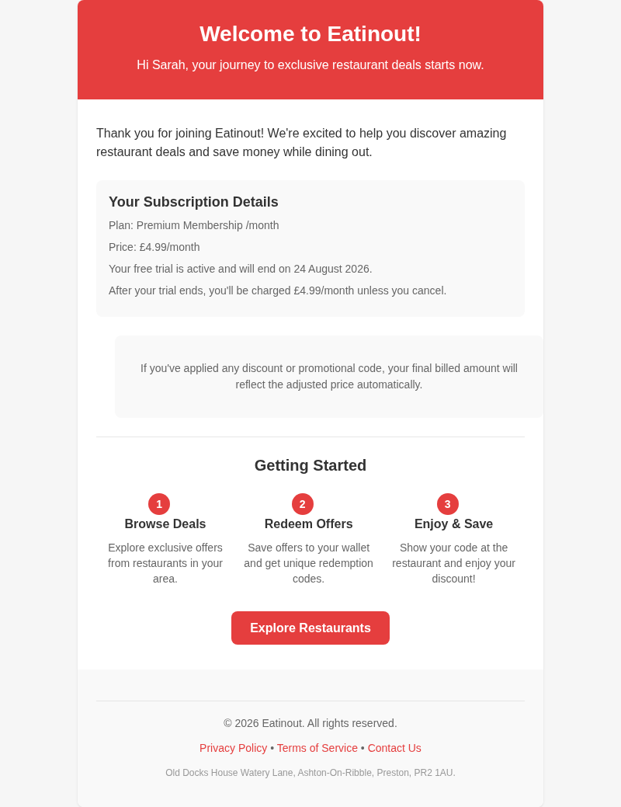
- **Mobile preview:** 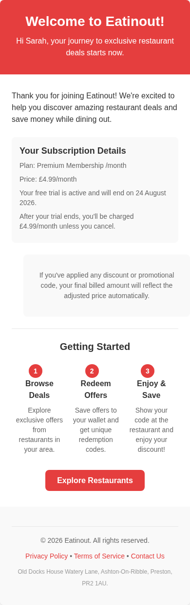

---

## 2. Subscription Confirmed

- **Business purpose:** Confirm the subscription/billing setup and plan details.
- **Audience:** Newly subscribed end customers.
- **Exact trigger:** Same checkout verification as the Welcome email (sent immediately after it).
- **Trigger conditions:** `POST /api/payment/verify-checkout-session` succeeds.
- **Timing:** Immediately after checkout verification, right after the Welcome email in the same request.
- **Recipient source:** `user.email`.
- **Automatic or manual:** Automatic.
- **Facing:** Customer-facing.
- **Subject line:** `Your Subscription is Confirmed!`
- **Sender name / email:** `Eatinout` / `Info@eatinout.com`
- **Call to action:** Confirmation of plan; button to the app.
- **Current status:** Active. Note: `billingDate` is hardcoded to `"15th of each month"` in the calling route.
- **Source file:** `utils/email-templates/subscription-confirmation.tsx` (sent from `app/api/payment/verify-checkout-session/route.ts`).
- **Desktop preview:** 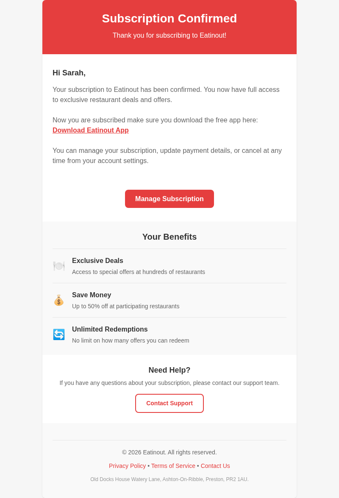
- **Mobile preview:** 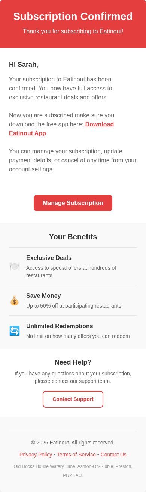

---

## 3. Password Reset

- **Business purpose:** Allow a user to reset a forgotten password.
- **Audience:** Any registered user (customer or restaurant).
- **Exact trigger:** User requests a password reset.
- **Trigger conditions:** `POST /api/auth/forgot-password` finds a matching user and stores a reset token.
- **Timing:** Immediately on request.
- **Recipient source:** The `email` submitted in the request (matched to a user record).
- **Automatic or manual:** Automatic.
- **Facing:** Customer-facing (also usable by restaurant users).
- **Subject line:** `Password Reset Request`
- **Sender name / email:** `Eatinout` / `Info@eatinout.com`
- **Call to action:** "Reset Password" button linking to `/forgot-password?token=…`. Link expires in 1 hour.
- **Current status:** Active.
- **Source file:** `utils/email-templates/password-reset.tsx` (sent from `app/api/auth/forgot-password/route.ts`).
- **Desktop preview:** 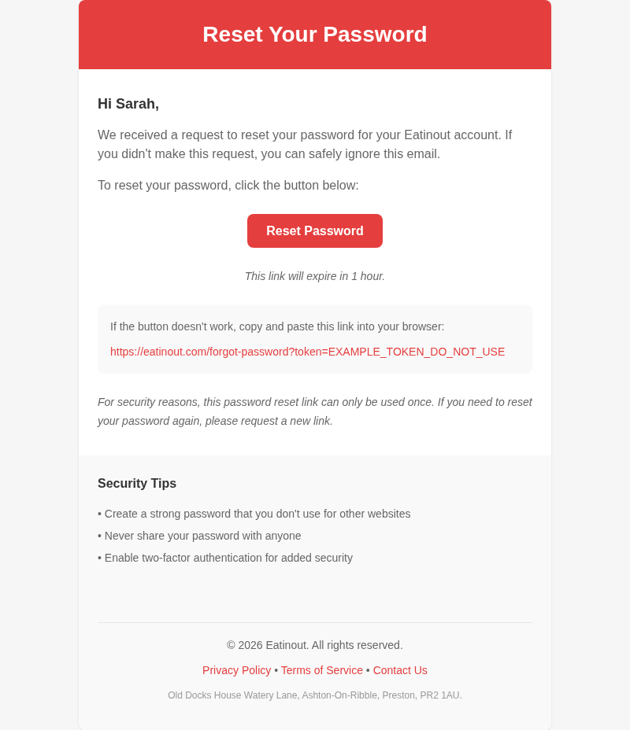
- **Mobile preview:** 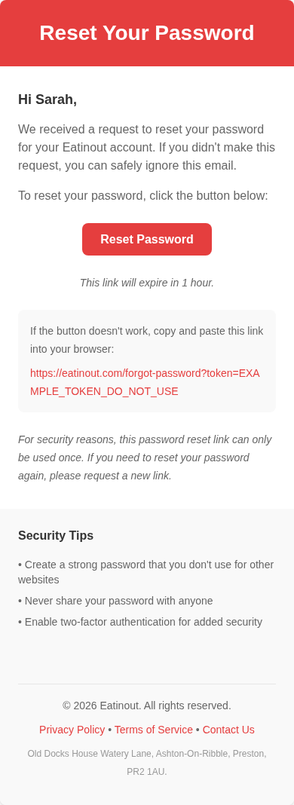

---

## 4. Account Deletion Request

- **Business purpose:** Notify the Eatinout team that a user has requested account deletion (GDPR/erasure handling).
- **Audience:** Internal Eatinout team.
- **Exact trigger:** User submits a delete-account request.
- **Trigger conditions:** `POST /api/delete-account` resolves a valid user.
- **Timing:** Immediately on request.
- **Recipient source:** Hardcoded to `info@eatinout.com` (the affected user's details are in the body).
- **Automatic or manual:** Automatic.
- **Facing:** Internal.
- **Subject line:** `Account Deletion Request`
- **Sender name / email:** `Eatinout` / `Info@eatinout.com`
- **Call to action:** Internal action to process the deletion (contains user name, email, ID, request date).
- **Current status:** Active. Triggered from the customer payment page and restaurant dashboard settings.
- **Source file:** `utils/email-templates/AccountDeletionRequestEmail.tsx` (sent from `app/api/delete-account/route.ts`).
- **Desktop preview:** 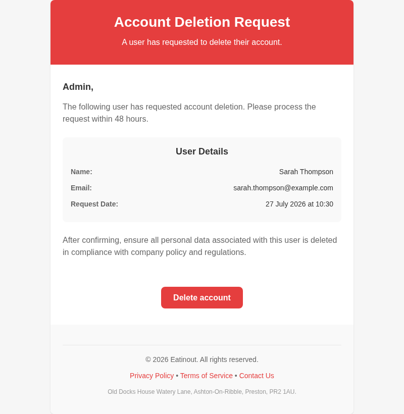
- **Mobile preview:** 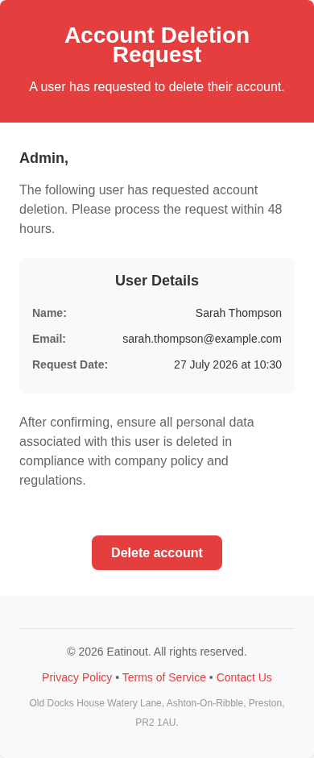

---

## 5. Restaurant Registration Received

- **Business purpose:** Acknowledge a restaurant's registration submission and set expectations for review.
- **Audience:** Restaurant owners/partners.
- **Exact trigger:** Restaurant registration is submitted.
- **Trigger conditions:** `POST /api/restaurants/register` successfully creates the restaurant record.
- **Timing:** Immediately after registration (non-blocking; failures are logged, not fatal).
- **Recipient source:** `user.email` of the registering owner.
- **Automatic or manual:** Automatic.
- **Facing:** Restaurant-facing.
- **Subject line:** `Eatinout - We've received your registration for {restaurantName}`
- **Sender name / email:** `Eatinout` / `Info@eatinout.com`
- **Call to action:** Informational — "we'll review your submission"; includes restaurant image.
- **Current status:** Active.
- **Source file:** `utils/email-templates/RestaurantRegistrationEmail.tsx` (sent from `app/api/restaurants/register/route.ts`).
- **Desktop preview:** 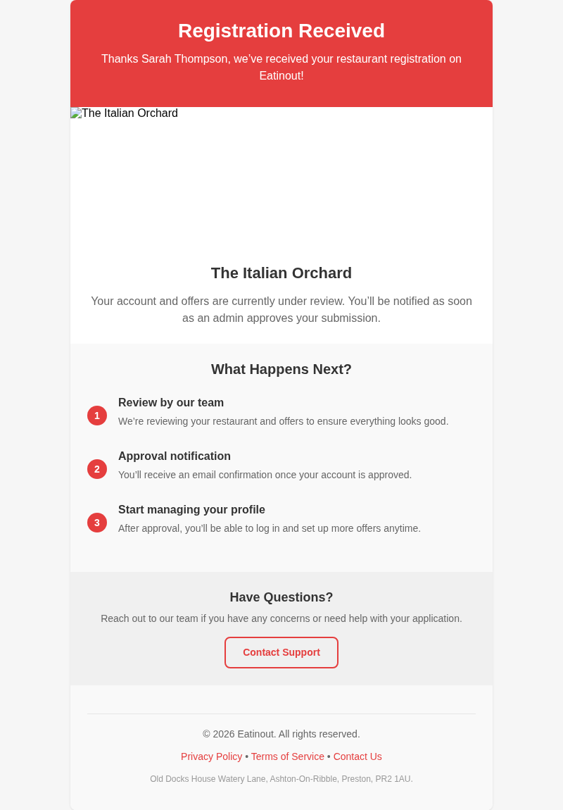
- **Mobile preview:** 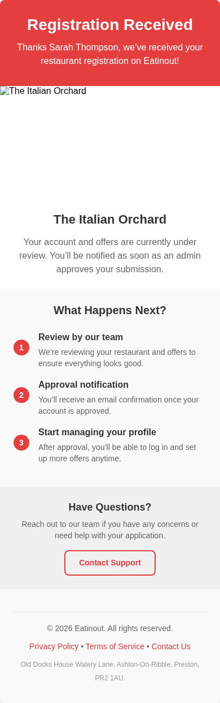

---

## 6. Restaurant Approved

- **Business purpose:** Tell a restaurant partner their venue has been approved and is now live.
- **Audience:** Restaurant owners/partners.
- **Exact trigger:** An admin sets a restaurant's status to "approved".
- **Trigger conditions:** `PATCH/POST /api/admin/restaurants/[id]/status` with `status === "approved"` and a linked `restaurant.userId`.
- **Timing:** Immediately when the admin approves the restaurant.
- **Recipient source:** `user.email` of the restaurant owner (looked up via `restaurant.userId`).
- **Automatic or manual:** Automatic, but initiated by a manual admin action.
- **Facing:** Restaurant-facing.
- **Subject line:** `Your Restaurant Has Been Approved!`
- **Sender name / email:** `Eatinout` / `Info@eatinout.com`
- **Call to action:** Encourages the owner to log in / manage their venue; includes restaurant image.
- **Current status:** Active. Falls back to a `via.placeholder.com` image if no restaurant image exists.
- **Source file:** `utils/email-templates/restuarant-approval.tsx` (sent from `app/api/admin/restaurants/[id]/status/route.ts`).
- **Desktop preview:** 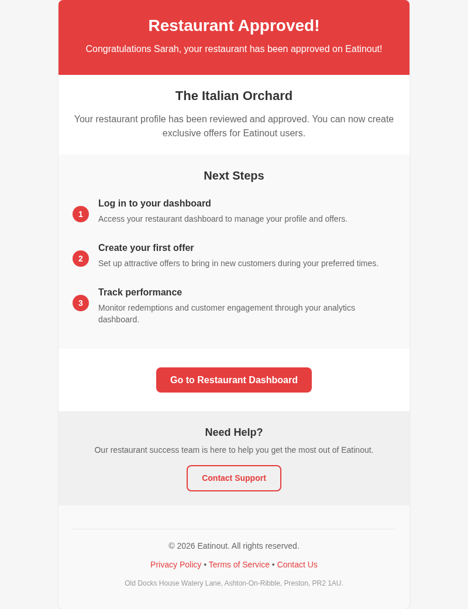
- **Mobile preview:** 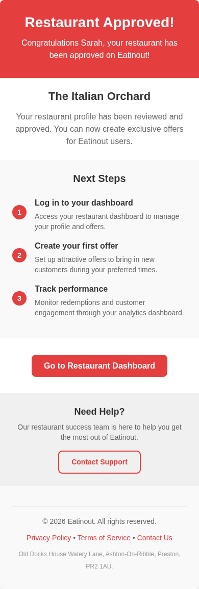

---

## 7. New Offer Submission

- **Business purpose:** Notify the offers team that a restaurant has submitted a new offer for review.
- **Audience:** Internal Eatinout offers team.
- **Exact trigger:** A restaurant creates/submits an offer.
- **Trigger conditions:** `POST /api/restaurant/offers` successfully saves the offer.
- **Timing:** Immediately after the offer is saved (non-blocking; failures are logged, not fatal).
- **Recipient source:** Hardcoded to `offers@eatinout.com`.
- **Automatic or manual:** Automatic.
- **Facing:** Internal.
- **Subject line:** `New Offer Submission`
- **Sender name / email:** `Eatinout` / `Info@eatinout.com`
- **Call to action:** Internal review — contains full offer details (title, description, type, valid days/hours, dates, T&Cs).
- **Current status:** Active.
- **Source file:** `utils/email-templates/NewOfferSubmissionEmail.tsx` (sent from `app/api/restaurant/offers/route.ts`).
- **Desktop preview:** 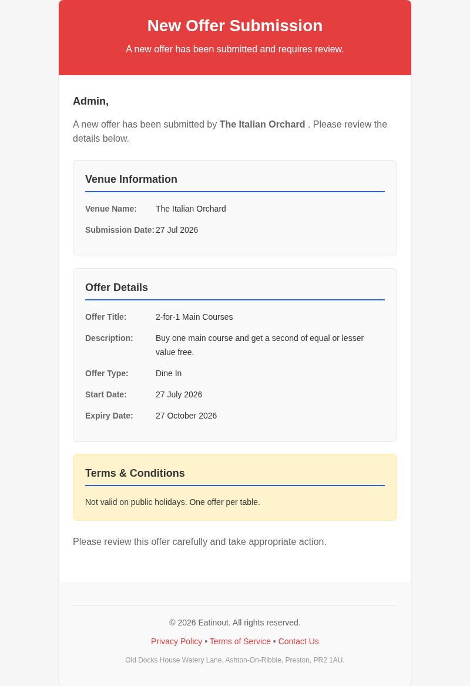
- **Mobile preview:** 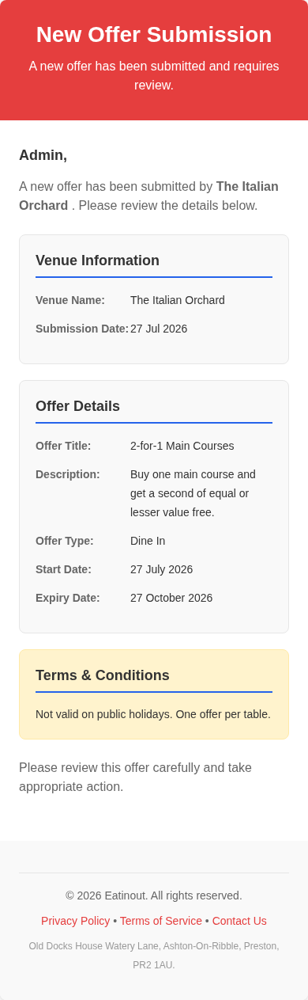

---

## 8. Contact / Enquiry Form

- **Business purpose:** Deliver contact/enquiry form submissions to the Eatinout inbox.
- **Audience:** Internal Eatinout team.
- **Exact trigger:** A visitor submits the contact form (restaurant enquiry or user enquiry).
- **Trigger conditions:** `POST /api/send-contact-email` with `type` of `"restaurant"` or `"user"`.
- **Timing:** Immediately on submission.
- **Recipient source:** Hardcoded to `info@eatinout.com`.
- **Automatic or manual:** Automatic.
- **Facing:** Internal.
- **Subject line:** `New Restaurant/Venue Enquiry` (restaurant type) or `New User Enquiry` (user type).
- **Sender name / email:** `Eatinout` / `Info@eatinout.com`
- **Call to action:** Internal reply — contains name, email, phone, restaurant/location, enquiry type, message.
- **Current status:** Active. **Built as inline HTML** (`getContactEmailHTML`), not the shared template layout. Triggered from both the user contact page and the marketing contact page.
- **Source file:** `utils/email-templates/contactEmail.tsx` (sent from `app/api/send-contact-email/route.ts`).
- **Desktop preview (restaurant enquiry):** 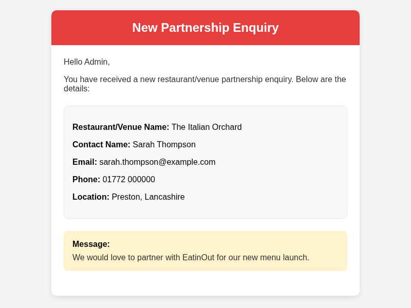
- **Mobile preview (restaurant enquiry):** 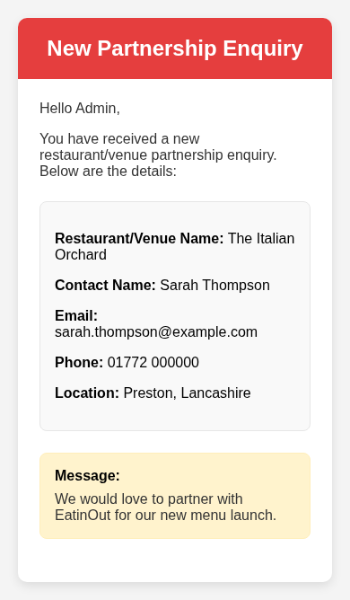
- **Desktop preview (user enquiry):** 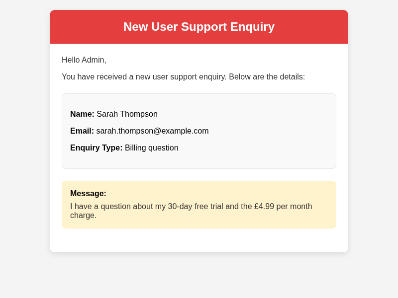
- **Mobile preview (user enquiry):** 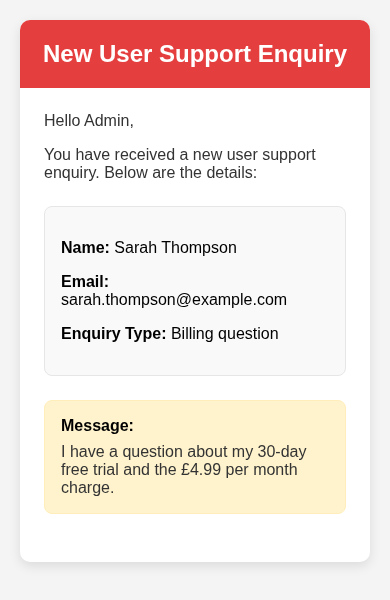

---

## 9. Email-Change OTP Verification

- **Business purpose:** Verify ownership of a new email address before a restaurant user changes their account email.
- **Audience:** Restaurant users (from dashboard settings).
- **Exact trigger:** User requests to change their account email.
- **Trigger conditions:** `POST /api/restaurant/request-email-change` with a `newEmail` that is not already registered.
- **Timing:** Immediately; the OTP is valid for 5 minutes.
- **Recipient source:** The `newEmail` supplied in the request.
- **Automatic or manual:** Automatic.
- **Facing:** Restaurant-facing (customer-facing in nature — sent to the user's new address).
- **Subject line:** `OTP Verification`
- **Sender name / email:** `EatinOut Info` / `Info@eatinout.com` — **inconsistent sender name vs. all other mail.**
- **Call to action:** Enter the 6-digit OTP shown in the email to confirm the address.
- **Current status:** Active. **Built as inline HTML inside the route** — does not use the shared template, branding, or footer.
- **Source file:** `app/api/restaurant/request-email-change/route.ts` (no separate template file).
- **Desktop preview:** 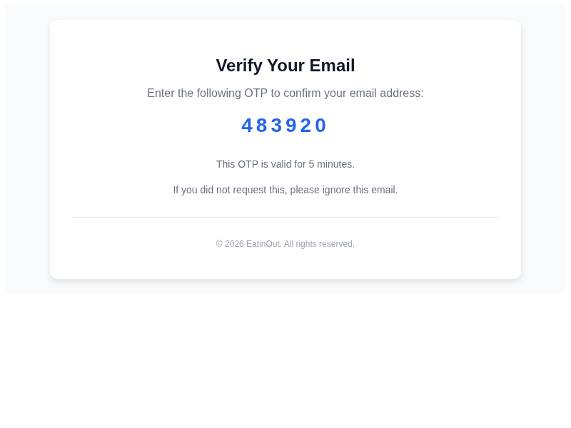
- **Mobile preview:** 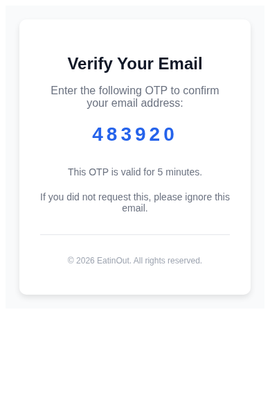

---

## 10. Subscription Cancellation — Trial (immediate)

- **Business purpose:** Confirm that a free-trial member cancelled and their access ended immediately with no charge.
- **Audience:** End customers on a free trial who cancel.
- **Exact trigger:** A trialing member cancels their membership.
- **Trigger conditions:** `DELETE /api/subscriptions` while the Stripe subscription status is `trialing`, on a genuine trialing→cancelled transition (guarded so a repeat request does not re-send).
- **Timing:** Immediately on cancellation.
- **Recipient source:** `user.email`.
- **Automatic or manual:** Automatic.
- **Facing:** Customer-facing.
- **Subject line:** `Your Eatinout free trial has been cancelled`
- **Sender name / email:** `Eatinout` / `Info@eatinout.com`
- **Call to action:** Invitation to start a new membership (no reactivation of the cancelled trial). No paid-through date shown.
- **Current status:** Active. Rendered via the `mode: "trial_immediate"` branch of the cancellation template.
- **Source file:** `utils/email-templates/SubscriptionCancellationEmail.tsx` (sent from `app/api/subscriptions/route.ts`).
- **Desktop preview:** 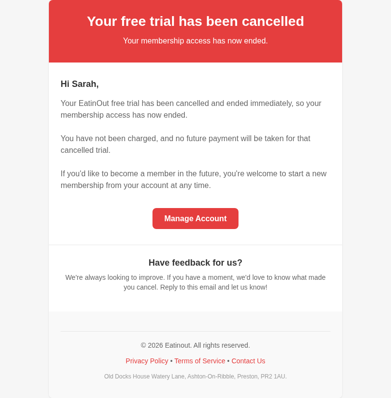
- **Mobile preview:** 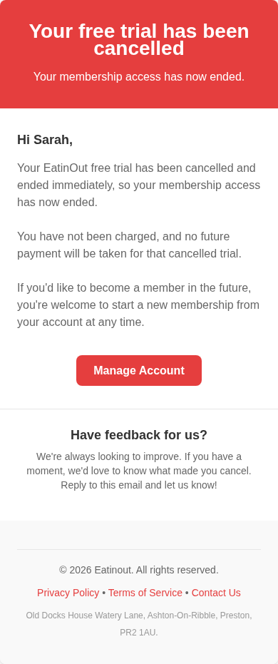

---

## 11. Subscription Cancellation — Paid (scheduled)

- **Business purpose:** Confirm a paying member's cancellation is scheduled and access continues until the paid-through date.
- **Audience:** Paying end customers who cancel.
- **Exact trigger:** A paying member cancels their membership.
- **Trigger conditions:** `DELETE /api/subscriptions` on a paid subscription, only on the not-scheduled→scheduled transition (`cancel_at_period_end` set to true; guarded against re-send).
- **Timing:** Immediately on cancellation; access continues to `current_period_end`.
- **Recipient source:** `user.email`.
- **Automatic or manual:** Automatic.
- **Facing:** Customer-facing.
- **Subject line:** `Your Eatinout membership cancellation is scheduled`
- **Sender name / email:** `Eatinout` / `Info@eatinout.com`
- **Call to action:** Reactivate before the access-end date; shows the exact paid-through date (formatted `en-GB`).
- **Current status:** Active. Rendered via the `mode: "paid_scheduled"` branch of the cancellation template.
- **Source file:** `utils/email-templates/SubscriptionCancellationEmail.tsx` (sent from `app/api/subscriptions/route.ts`).
- **Desktop preview:** 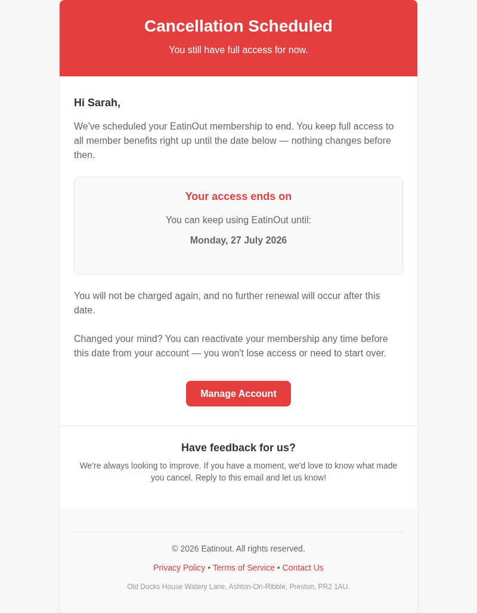
- **Mobile preview:** 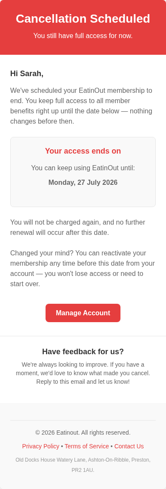

---

## 12. Subscription Reactivation

- **Business purpose:** Confirm a scheduled cancellation was reversed and the membership is active again.
- **Audience:** Paying end customers who reactivate a scheduled-cancellation.
- **Exact trigger:** A member reactivates their membership.
- **Trigger conditions:** `PATCH /api/subscriptions` with `action: "reactivate"`, only when a scheduled cancellation was genuinely reversed (`wasScheduled`).
- **Timing:** Immediately on reactivation.
- **Recipient source:** `user.email`.
- **Automatic or manual:** Automatic.
- **Facing:** Customer-facing.
- **Subject line:** `Your Eatinout membership is active again`
- **Sender name / email:** `Eatinout` / `Info@eatinout.com`
- **Call to action:** Reassurance of continued access; shows the next payment date (formatted `en-GB`).
- **Current status:** Active. Triggered from the account page and payment page reactivation controls.
- **Source file:** `utils/email-templates/SubscriptionReactivationEmail.tsx` (sent from `app/api/subscriptions/route.ts`).
- **Desktop preview:** 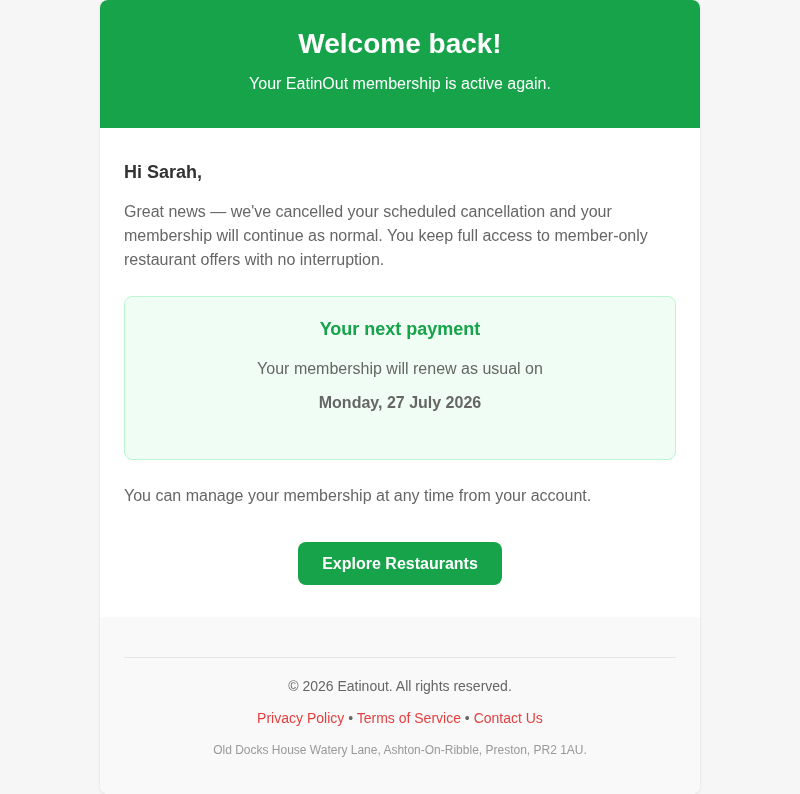
- **Mobile preview:** 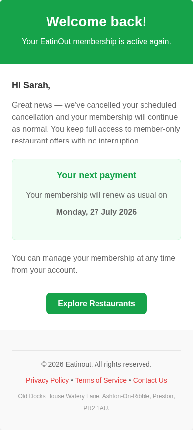

---

## NOTES & OBSERVATIONS

- **Commented-out email in login route:** `app/api/auth/login/route.ts` contains a fully commented-out `RestaurantRegistrationEmail` send with hardcoded test data (`Kavta Jakhar` / `Musafir Cafe` / `kavita@antheminfotech.com`). It is inactive but should be removed as dead/debug code.
- **Placeholder recipients in test paths:** the commented login block and several `via.placeholder.com` image fallbacks indicate leftover development scaffolding.
- **Trial length wording:** all trial copy is consistently "30 days"; the Welcome email uses Stripe's authoritative `trial_end` where available, falling back to now + 30 days.
- **Rendering method:** previews were produced by rendering the real templates with `@react-email/render` using representative example data, served locally and screenshotted at 800px (desktop) and 390px (mobile). No template markup was altered to generate them.
- **Logo:** the shared layout's logo `` is commented out, so brand logo is absent from all templated emails; the OTP and contact emails never had one.

## DELIVERABLES

- **Report:** `email-audit-previews/EMAIL-AUDIT-REPORT.md` (this file).
- **Rendered HTML:** `email-audit-previews/html/` (13 files).
- **Preview images:** `email-audit-previews/images/` (26 PNGs — desktop + mobile for each).
